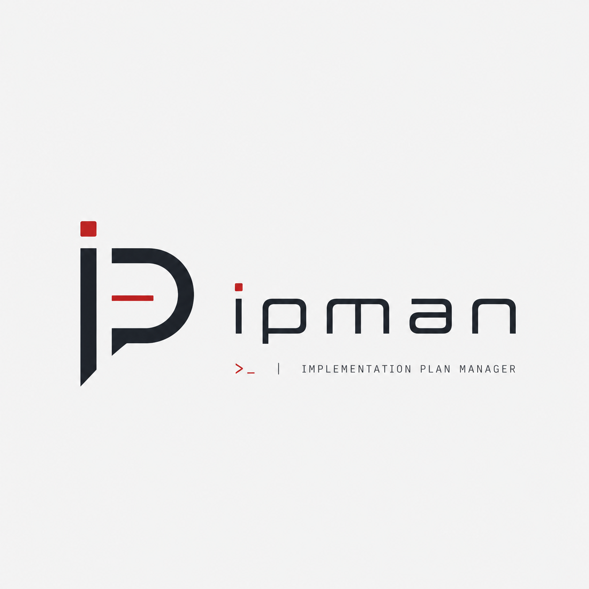

<div align="center">



# ipman — Implementation Plan Manager

**Durable, encrypted plan-tracking for AI coding agents and the humans who supervise them.**

Single C binary · SQLCipher-encrypted SQLite · JSON-on-stdin protocol · Linux

</div>

---

`ipman` is an implementation-plan database. The canonical surface is a **JSON request/response protocol** for AI agents (Claude Code, Codex, your own); over it, a terse CLI exposes **shortcuts** that wrap a single op for routine writes (`ipman --start`, `ipman --close`) and **views** that compose several ops into one rendered display for inspection (`ipman -S`, `ipman -N`). Plans live in an encrypted SQLite file inside the project (`./.ipman/ipman.db`), so context survives between agent sessions, between agents, and between you and the agent.

It is the missing piece for agents that already write good code but forget what they are doing the moment the conversation compacts.

## Table of contents

- [Why ipman?](#why-ipman)
- [Five-minute tour](#five-minute-tour)
- [Three surfaces, one database](#three-surfaces-one-database)
- [Concepts](#concepts)
- [Programmatic surface](#programmatic-surface)
- [MCP server (optional)](#mcp-server-optional)
- [Security](#security)
- [CLI reference](#cli-reference)
- [Operations reference](#operations-reference)
- [Building from source](#building-from-source)
- [Project layout](#project-layout)
- [Status and roadmap](#status-and-roadmap)
- [Contributing](#contributing)
- [License](#license)

## Why ipman?

Modern coding agents are good at executing one task; they are bad at remembering *why* they were doing it. Markdown TODO files rot. Issue trackers are not local. Conversation history evaporates on `/compact`. Agents that work for hours need durable, structured state that they themselves can read and write.

`ipman` is shaped around that need:

- **Plans, phases, and tasks** are first-class objects with stable numeric identifiers — agents can reference them across sessions without scanning prose.
- **Closure records** preserve outcomes: when a task is closed, cancelled, deferred, or replaced, the audit trail keeps the *why*, not just the new status.
- **Standing instructions** attach durable guidance to a plan or phase ("preserve backward compatibility until v2"), so future agents pick up the constraints automatically.
- **Encrypted at rest** by default — your in-progress work and design notes never sit in plaintext on disk.
- **Single static-ish binary**: one process, one SQLite file, no daemon, no server, no network.
- **Self-documenting**: after `init`, the `.ipman/` directory contains per-operation request schemas the agent can read instead of guessing.

If you have ever asked an agent "what was the plan again?" three turns in a row, this is the shape of the fix.

## Five-minute tour

### 1. Install

Linux (Debian/Ubuntu shown; adapt for your distro):

```sh
sudo apt install build-essential pkg-config libsqlcipher-dev libsodium-dev
git clone <your-fork-url> ipman && cd ipman
make BUILD=release
make install                     # installs to ~/.local/bin/ipman
                                 # plus skill bundles for Claude Code and Codex
```

Confirm it works:

```sh
ipman -U                         # show usage
```

### 2. Initialize a workspace

`ipman` operates per-project. From your project root:

```sh
ipman --init
```

That creates `./.ipman/` (mode `0700`) with the encrypted database, the per-project key salt, and a generated `START-HERE.md` for any agent that opens the directory.

### 3. Drive the loop with CLI verbs

Plan and task creation are agent-driven (see [Programmatic surface](#programmatic-surface)) — the CLI does not expose `plan.create` or `task.create`. Once your agent has populated a plan, supervise it from the shell:

```sh
ipman -N                         # session entry-point: active plan, cursor,
                                 # standing instructions, and "Up next" tasks

ipman --activate ship-login      # switch the active plan
                                 # (selectors: id, uid, label, or code)

ipman --start move-jwt-verification-into-middleware
                                 # mark the task in_progress

ipman --close move-jwt-verification-into-middleware \
  --summary "Centralized JWT decode in mw_auth.c" \
  --comment "Caller updated the cache key; see PR #214" \
  --validation "make test:passed" \
  --decision "Defer the rename to a follow-up — out of scope here"
                                 # close with closure record;
                                 # auto-captures commit_sha, dirty, files_changed
```

Inspection-only flow looks like:

```
$ ipman -S
┌───────────────┬──────────────────────────┐
│     Field     │           Value          │
├───────────────┼──────────────────────────┤
│ Active plan   │ P1 · Ship login refactor │
├───────────────┼──────────────────────────┤
│ Current phase │ none                     │
├───────────────┼──────────────────────────┤
│ Current task  │ none                     │
├───────────────┼──────────────────────────┤
│ Pending tasks │ 2                        │
└───────────────┴──────────────────────────┘

$ ipman -L
┌───────────────────────────────────────────┬──────────┬────────┬────────────────────────────────┐
│                   Label                   │ Priority │ Status │             Title              │
├───────────────────────────────────────────┼──────────┼────────┼────────────────────────────────┤
│ move-jwt-verification-into-middleware     │ medium   │ todo   │ Move JWT verification ...      │
│ replace-session-cookie-storage-with-redis │ medium   │ todo   │ Replace session cookie ...     │
└───────────────────────────────────────────┴──────────┴────────┴────────────────────────────────┘
```

That is the full feedback loop: the agent edits the plan, you read it with `-N`, you push back, the agent picks up the changes. For the complete CLI surface, run `ipman --usage` or see [CLI reference](#cli-reference).

## Three surfaces, one database

The same data is reachable three ways. Pick the one that fits the call site:

- **`ops`** — the **JSON request/response protocol**. The complete, canonical surface: 76 operations (`plan.create`, `task.transition`, `closure.get`, …) covering every read and every mutation. This is what AI agents and scripts call: `… | ipman` with a JSON envelope on stdin, JSON on stdout, exit code via [error semantics](#error-semantics).
- **`shortcuts`** — CLI verbs that wrap a single op apiece. `ipman --start`, `ipman --close`, `ipman --defer`, `ipman --show`, `ipman --log`, `ipman --current`, `ipman --activate`, etc. Each shortcut is exactly one op under the hood, so the audit trail is identical to the agent-driven path. Use them when supervising directly without hand-rolling JSON.
- **`views`** — CLI verbs that compose several ops into one rendered display. `ipman -S` (status), `ipman -L` (ls), `ipman -N` (next), `ipman -R` (render). `-N` is the canonical handoff view: it replaces the typical `workspace.context_get` + `plan.get` + `phase.get` + `task.get` + `instruction.list` (×3 scopes) + `task.list` sequence with one call. Views save typing for the operator; agents that need the constituent data should call the underlying ops directly.

Setup, maintenance, and emergency escape hatches live under **`admin`** (`ipman init`, `--migrate-encrypt`, `export --plaintext`, `sql`). They sit outside the op model on purpose. Output across all three surfaces is JSON on stdout for `ops`, box-drawn tables on stdout (errors on stderr) for `shortcuts` and `views`.

The agent drives the heavy lifting (creating plans, decomposing into phases, threading comments). The shortcuts and views are enough to step in for routine transitions when supervising directly — start a task, close it with a summary, defer one with a reason — without ever leaving the shell or hand-rolling JSON.

## Concepts

### Hierarchy

```
Plan ── one per implementation effort, holds outcome and tags
 └── Phase ── ordered milestones inside a plan
      └── Task ── atomic units of work; carry status, type, priority, origin
```

**`id` is canonical.** Every entity is identified by an integer `id` for both input and output. Pass `id` to every op that needs to reference an existing plan, phase, or task; `id` is what API responses return.

| Field | Role | Notes |
|---|---|---|
| `id` | Canonical input and output identifier | Workspace-scoped integer (e.g. `42`). The only selector accepted by `*.get`, `*.update`, lifecycle ops, etc. |
| `label` | Human-readable slug | Auto-derived from `title` (or supplied at creation). Scoped per parent and renameable. Returned on responses for human display. |
| `code` | User-supplied plan shorthand | Short label like `REL-001`, set at `plan.create`. Used as a `plan.lookup` key and `plan.activate` selector; returned where workspace context and exports need the display handle. |
| `uid` | Stored row identifier (storage only) | Internal `task_<id>`/`phase_<id>`/`plan_<id>` form. Persisted in the database for archival/export round-trip but omitted from ordinary entity responses. |

To resolve a `label` or `code` to an `id`, call the matching `*.lookup` op (`plan.lookup`, `phase.lookup`, `task.lookup`). Lookup ops are the single legitimate way to translate human-readable handles into the canonical `id`.

### Status, resolution, and origin are different things

A common bug in self-rolled trackers is conflating these:

- **`status`** — where the entity is *now* (`todo`, `in_progress`, `done`, `canceled`, …).
- **`resolution`** — *how* a terminal state was reached (`completed`, `not_planned`, `discarded`, `duplicate`).
- **`origin_type`** — *where* the work came from (`planned`, `discovered`, `requested`).

Closure operations (`task.close`, `task.cancel`, `task.replace`, `task.mark_duplicate`) set the resolution explicitly so the audit trail can answer "did we actually finish, or did we drop it?".

### Audit trail and closure memory

Every state transition emits an event. Every terminal transition writes a `closure_record` capturing:

- `outcome_summary` — what happened in one line
- `closing_comment` — the note the agent or human attached
- `lessons_learned` — durable knowledge worth carrying into the next plan
- `open_items_summary` — what was deliberately *not* done

Re-opened entities preserve their previous closure record, so an agent that resumes work two weeks later can read why it was paused.

### Standing instructions

Use `instruction.add` for durable guidance ("never modify migrations after merge", "this plan must preserve backward compatibility"). Use `comment.add` for conversational notes and decisions in flight. The two are deliberately distinct surfaces: agents reading at session start are pointed at instructions first.

## Programmatic surface

Agents drive the heavy lifting — creating plans, decomposing into phases, threading comments — by sending one JSON request on stdin and reading one JSON response on stdout:

```sh
echo '{"protocol_version":2,"request_id":"r1","actor":"agent",
       "op":"plan.create",
       "params":{"title":"Ship login refactor",
                 "summary":"Split auth from session handling",
                 "priority":"high"}}' | ipman
```

Response:

```json
{"request_id":"r1","ok":true,"result":{"plan":{
  "id":1,"label":"ship-login-refactor",
  "title":"Ship login refactor","status":"open","priority":"high",
  "created_at":"2026-04-30T12:33:11.373Z", ...}}}
```

Use `ipman --b64` when shell escaping is awkward — stdin and stdout become base64-encoded JSON. The full operation surface (76 ops across 13 entities) is enumerated under [Operations reference](#operations-reference).

### How agents discover the API

`ipman --init` (and the periodic `workspace.refresh_agent_docs`) writes auto-generated documentation into `.ipman/`:

```
.ipman/
├── START-HERE.md                        # entry point for any agent
├── manifest.json                        # machine-readable op list
├── indexes/
│   ├── ipman.index.operations.md        # alphabetical
│   ├── ipman.index.by-entity.md         # grouped by plan/phase/task/...
│   └── ipman.index.by-workflow.md       # grouped by intent (handoff, closure, ...)
├── operations/
│   └── ipman.op.<entity>.<verb>.schema.md      # human-readable per-op schema
└── schemas/
    └── ipman.op.<entity>.<verb>.request.schema.json   # JSON Schema for the request
```

These files are regenerated from the binary on every `init`, so the documentation cannot drift from the runtime — there is an integration test (`tests/integration/000_operation_docs_parity.sh`) that fails the build if it does.

The bundled skill at `.claude/skills/ipman/SKILL.md` instructs agents to read those files instead of guessing parameter shapes. Drop the skill into your Claude Code or Codex install (`make install-skills` does this) and your agent will know how to use `ipman` on first contact.

### Error semantics

| Code | Meaning | Exit code |
|---|---|---|
| `invalid_request` | Malformed JSON or envelope | 1 (fatal) |
| `internal_error` | Database/IO failure | 1 (fatal) |
| `unknown_op` | Op name not registered | 0 (semantic) |
| `validation_failed` | Bad params or business-rule violation | 0 (semantic) |
| `not_found` | Entity missing | 0 (semantic) |
| `conflict` | Bad state transition, duplicate, circular reference | 0 (semantic) |

The exit-code split lets agents distinguish "the request itself is broken — stop retrying" from "the request ran and reported a normal failure mode — read `error.code`".

## MCP server (optional)

A small Python adapter at [`mcp/ipman_mcp.py`](mcp/ipman_mcp.py) exposes every ipman operation as an MCP tool over JSON-RPC 2.0 with LSP-style framing. Use it from MCP-aware clients (Claude Desktop, Cursor, Continue, custom agent stacks) when you don't want them to pipe JSON to stdin themselves.

```sh
IPMAN_HOME=/path/to/project/.ipman \
IPMAN_BIN=$(which ipman) \
python3 mcp/ipman_mcp.py
```

The bridge reads `manifest.json` once at startup, builds one MCP tool per registered operation (65 of them after `ipman init`), and forwards `tools/call` invocations as JSON envelopes to the `ipman` binary. No third-party Python deps; Python 3.10+ required for the type-hint syntax. See [`mcp/README.md`](mcp/README.md) for client-config snippets and troubleshooting.

## Security

`ipman.db` is encrypted at rest using **SQLCipher** (AES-256 page-level encryption) with a key derived from a per-workspace 32-byte random salt via **libsodium's Argon2id** KDF. Specifically:

- The salt lives in `.ipman/keysalt` (mode `0600`).
- The KDF passphrase is derived from `IPMAN_KEY` if set, else from a stable per-user secret in your home directory.
- `.ipman/` itself is created with mode `0700` and the binary refuses to run if the directory has loose permissions.
- For emergency inspection, `ipman export --plaintext --i-understand <out.db>` writes a plaintext SQLite copy. The `--i-understand` flag is mandatory and the operation is logged.
- For migrating existing plaintext databases (early dev builds), `ipman --migrate-encrypt` rewrites the file in place.

This is *defense at rest*, not a sandbox. Anyone who can run `ipman` as your user can read the database. Treat it like an SSH key.

## CLI reference

Selectors accept a numeric `id`, a `uid` (e.g. `task_42`), or a `label` (resolved against the active plan). Every form is interchangeable with its bare-word and short-flag equivalents: `ipman -S` ≡ `ipman status` ≡ `ipman --status`. The short/long form is independent of the category — every command keeps both spellings.

For the design rationale, the no-goals, and migration patterns from hand-rolled v2.0 JSON, see [`docs/v2.1-ergonomics.md`](docs/v2.1-ergonomics.md).

### Shortcuts (read)

Each command below dispatches a single JSON op. The CLI just saves you the envelope.

```
ipman -SH / --show <selector>       Detail for a task or phase    → task.get / phase.get
ipman -LG / --log [--summary-only] [--limit N]
                                    Recent workspace events.      → event.list
                                    --summary-only drops the
                                    Details column; --limit N (1-500, default 20) caps
                                    rows (out-of-range values are clamped)
```

### Views

Each command below composes multiple JSON ops into a single rendered display. There is no single op that returns the same bundle — these views live in the CLI on purpose, so agents stay close to the constituent ops.

```
ipman -S  / --status                Active plan, current phase, current task, pending count
                                    → workspace.context_get + task.list (2 ops)
ipman -L  / --ls                    Pending tasks for the active plan
                                    → workspace.context_get + task.list (2 ops)
ipman -N  / --next                  Active plan + cursor + standing instructions + "Up next"
                                    → workspace.context_get + plan.get + phase.get + task.get
                                      + instruction.list ×3 + task.list (~8 ops)
ipman -R  / --render <plan>         Render plan as Markdown          → walks the plan tree
```

`ipman -N` is the session entry-point: one call replaces the full handoff sequence above.

### Shortcuts (write)

Each command below dispatches a single JSON op. The CLI handles selector resolution, captures git context where applicable, and prints a confirmation line.

```
ipman --start    <selector>                                  Mark a task in_progress
                                                             → task.transition({status:"in_progress"})
ipman --close    <selector> --summary <text> --comment <text>
                            [--lessons <text>] [--open-items <text>] [--followup]
                            [--validation <cmd:status>]... [--decision <text>]...
                            Close a task with closure record (auto-captures git state
                            when run inside a repo: commit_sha, dirty, files_changed)
                                                             → task.close
ipman --cancel   <selector> --summary <text> --comment <text>
                            Cancel a task with closure record
                                                             → task.cancel (resolution=canceled)
ipman --defer    <selector> --reason-text <text> [--reason-code <code>]
                            Defer a task with reason          → task.defer
ipman --close-phase  <selector> --summary <text> --comment <text>
                            [--lessons <text>] [--open-items <text>] [--followup]
                            Close a phase with closure record (all child tasks must
                            be terminal)                      → phase.close (outcome=completed)
ipman --cancel-phase <selector> --summary <text> --comment <text>
                            [--lessons <text>] [--open-items <text>] [--followup]
                            Cancel a phase with closure record
                                                             → phase.close (outcome=canceled)
ipman --current  <selector>         Set current task or phase (auto-detected)
                                                             → task.set_current / phase.set_current
ipman --activate <selector>         Set the active plan for the workspace
                                                             → plan.activate
```

`--validation` and `--decision` are repeatable and surface as structured evidence in the closure record (rendered in `closure.get` and the plan markdown).

#### Modifier

```
ipman --dry-run             Combine with any write shortcut to print the JSON
                            envelope that would be sent and exit without touching
                            the DB. The printed envelope is valid JSON and can be
                            piped back into ipman if you decide to run it.
```

### Admin

Setup, maintenance, and emergency escape hatches. These do not fit the op model.

```
ipman -I  / --init                  Initialize workspace (creates ./.ipman/)
ipman -U  / --usage                 Show full help
ipman -V  / --version               Print binary version
ipman --migrate-encrypt             Convert a plaintext ipman.db to encrypted in-place
ipman export --plaintext --i-understand <out.db>
                                    Emergency dump to plaintext SQLite
ipman sql "SQL..."                  Ad-hoc SQL escape hatch (developer / test only)
```

### Agent protocol

```
ipman < request.json                JSON request/response on stdin/stdout
ipman -B / --b64 < request.b64      Same, with base64-encoded JSON input
```

### Examples

Start a task, close it with structured evidence, defer another, all without leaving the shell:

```sh
ipman --start review-pr-42

ipman --close review-pr-42 \
  --summary "Approved with two small tweaks" \
  --comment "Caller updated the cache key; LGTM" \
  --validation "make test:passed" \
  --validation "shellcheck scripts/:passed" \
  --decision "Defer the rename to a follow-up — out of scope here"

ipman --defer migrate-redis-cluster \
  --reason-text "Blocked on infra ticket INFRA-2031" \
  --reason-code external_dependency
```

Preview the JSON envelope without committing:

```sh
ipman --close review-pr-42 \
  --summary "..." --comment "..." --dry-run
```

## Operations reference

The runtime exposes 76 operations across 13 entities. The full, always-current list lives at `.ipman/indexes/ipman.index.operations.md` after init; here is the shape:

| Entity | Common verbs |
|---|---|
| `plan` | `create`, `activate`, `update`, `list`, `get`, `progress`, `history`, `comment_add`, `archive`, `close`, `reopen`, `export`, `deactivate` |
| `phase` | `create`, `update`, `move`, `list`, `get`, `list_tasks`, `progress`, `history`, `comment_add`, `close`, `reopen`, `set_current`, `clear_current` |
| `task` | `create`, `update`, `move`, `list`, `get`, `transition`, `defer`, `cancel`, `replace`, `mark_duplicate`, `close`, `reopen`, `comment_add`, `assign`, `unassign`, `set_current`, `clear_current`, `set_priority`, `set_type`, `set_origin`, `link_dependency`, `unlink_dependency`, `link_external` |
| `comment` | `add`, `list`, `update`, `invalidate` |
| `instruction` | `add`, `list`, `update`, `invalidate` |
| `event` | `list` |
| `closure` | `get` |
| `workspace` | `context_get`, `refresh_agent_docs` |
| `noop` | `noop` (round-trip / health check) |

Read `.ipman/operations/ipman.op.<entity>.<verb>.schema.md` for the parameters of any single operation.

## Building from source

### Requirements

- Linux (POSIX-targeted; not currently tested on macOS or BSD)
- A C11 compiler (`gcc` or `clang`)
- `make`, `pkg-config`
- `libsqlcipher-dev` (provides the SQLite C API plus AES page encryption)
- `libsodium-dev` (provides Argon2id)
- `bash`, `xxd`, `sha256sum` (used by the migration/skill embedders)

### Build targets

| Command | What it does |
|---|---|
| `make` | Dev build (`-O0`, `-Werror`, debug symbols) |
| `make BUILD=release` | Release build (`-O2`, stripped) |
| `make test` | Build, then run unit and integration tests |
| `make install` | Install binary to `$BINDIR` (default `~/.local/bin`) plus Claude/Codex skill bundles |
| `make install-skills` | Install only the agent skills, no binary |
| `make run` | Init a throwaway workspace and call `noop` (smoke test) |
| `make clean` | Remove `build/` |

Override paths with `PREFIX=`, `BINDIR=`, `CLAUDE_SKILLDIR=`, `CODEX_SKILLDIR=`, or `DESTDIR=` for staged installs.

### Testing

```sh
make test
```

Runs the C unit tests under `tests/unit/`, then every shell-driven integration test under `tests/integration/`. The integration suite covers generated operation-doc parity, request allowlist behavior, instruction lifecycle, CLI veneers, closure evidence, logging flags, and MCP schema/error handling.

## Project layout

```
ipman/
├── src/                  # All C sources — one .c/.h pair per module
│   ├── main.c            # Entry point, CLI shortcuts and views, argv routing
│   ├── dispatch.c        # Operation registry (single source of truth)
│   ├── protocol.c        # JSON envelope + error codes
│   ├── db.c              # SQLCipher connection setup
│   ├── migrations.c      # Embedded-migration runner
│   ├── *_ops.c           # One file per entity (plan, phase, task, …)
│   └── agent_docs.c      # Per-op schema and index generators
├── migrations/
│   ├── 0001_initial_schema.sql   # Consolidated baseline schema
│   ├── 0002_extend_closures.sql  # Git context fields
│   └── 0003_closure_evidence.sql # Structured validation/decision evidence
├── scripts/              # Build-time embedders (sql, skill)
├── tests/
│   ├── integration/      # Shell-driven black-box tests
│   └── unit/             # C unit tests
├── third_party/cjson/    # Vendored cJSON (tag-pinned)
├── .claude/skills/ipman/ # Bundled Claude Code skill (also baked into the binary)
├── mcp/                  # Optional MCP server (Python adapter for MCP-aware clients)
│   ├── ipman_mcp.py
│   └── README.md
├── Makefile
└── ipman-logo.png
```

The "single source of truth" pattern is deliberate: the dispatch table in `src/dispatch.c` drives the operation list, the `OperationSpec` table in `src/agent_docs.c` drives the generated docs, and the parity test fails if they diverge.

## Status and roadmap

**v2.2.0** — current release. Stable surfaces:

- JSON request/response protocol at `protocol_version: 2` (unchanged from v2.0; v2.1/v2.2 added zero protocol ops)
- All 76 operations across 13 entities
- Encrypted SQLite storage layout (SQLCipher + Argon2id)
- `.ipman/` generated documentation tree (regenerated on every `init`)
- Bundled Claude Code skill (also installed for Codex)
- Optional MCP server (`mcp/ipman_mcp.py`) for MCP-aware clients
- CLI shortcuts (1:1 wrappers over a JSON op): `--start`, `--close`, `--cancel`, `--defer`, `--close-phase`, `--cancel-phase`, `--current`, `--activate`, `--show`, `--log`, plus the `--dry-run` modifier; CLI views (compose multiple ops): `--status`, `--ls`, `--next`, `--render` (see [`docs/v2.1-ergonomics.md`](docs/v2.1-ergonomics.md) and [`docs/v2.2-ergonomics.md`](docs/v2.2-ergonomics.md))
- Structured closure evidence: `validations_run` and `decisions` on `task.close`, plus auto-captured git context (`commit_sha`, `dirty`, `files_changed`) when running inside a work tree

Planned (no commitment yet):

- macOS build support
- Codex skill parity tests
- Optional plain-SQLite mode for environments where SQLCipher is hard to install
- Additional task relationship types (`blocks`, `informs`, …)

Breaking wire changes bump `protocol_version` and ship a migration; the v1 → v2 cutover is documented in [`docs/v2-migration.md`](docs/v2-migration.md). v2.1 and v2.2 were purely additive over v2.0 — no wire changes, no client migration required.

## Contributing

Bug reports and patches welcome. Before opening a PR:

1. `make test` passes locally.
2. New operations include a schema entry in `OperationSpec` and a regression test.
3. Schema migrations are append-only — never edit a shipped migration in place.
4. The README and SKILL.md stay in sync with the binary (the parity test catches operation drift; doc text is on you).

The code follows a "no surprises" style: small functions, explicit error returns (`int rc`), no global state, no clever macros. Match the surrounding style and you will be fine.

## License

`ipman` is released under the **Apache License, Version 2.0**. See [`LICENSE`](LICENSE) for the full text and [`NOTICE`](NOTICE) for third-party attribution. Source files carry an SPDX header (`SPDX-License-Identifier: Apache-2.0`).

This means you can use, modify, embed, and redistribute `ipman` (including in commercial and closed-source products), provided you preserve attribution and the license text. Apache-2.0 also includes an explicit patent grant — see Section 3 of the License.
